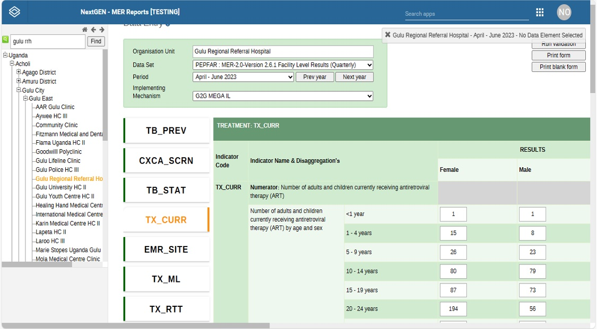
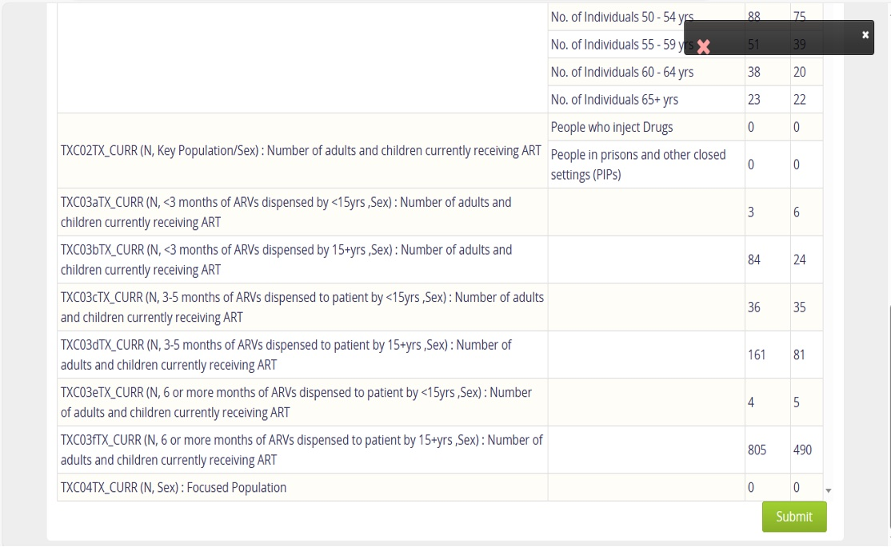

# Integration of the DHIS2 Connector Automation Sync Module at USAID Supported Health Facilities
## Objective
This project aimed to integrate the DHIS Connector Automation Sync Module with the electronic medical records system as part of the Next Generation Reporting System (NextGen MER) across supported health facilities. The purpose was to improve system utilization and enhance the synchronization of health data reports for better decision-making.
## Key Activities: 
### Stakeholder Engagement
- Conducted entry and debrief meetings with district health teams, implementing partners, and health facility teams to ensure alignment of objectives and smooth execution of the pilot study.
### System Integration
- Coordinated the installation and integration of the DHIS2 Connector Automation Sync Module at 10 health facilities, ensuring configurations adhered to standard operating procedures for optimal use.
### Data Collection & Troubleshooting
- Collected system performance data and identified challenges such as slow EMR server speeds and power supply issues that impacted system performance at some facilities. We also worked with the information technology teams to resolve these issues
### Reporting & Feedback
- Documented the integration process and presented findings to stakeholders. 
- Provided actionable recommendations for system improvements, including additional technical support and further training for health facility data teams.
## Outcome:
- The pilot study successfully tested and validated the synchronization of aggregate reports across the health facilities, offering valuable insights into the functionality of the system.
- Identified key challenges, including power supply and server speed issues, and actionable recommendations were provided for future improvements.
## Tools and technologies used: 
- Health information system
- Microsoft Excel and Word for documentation
- Basic information technology tools for training
## Visuals of the Integration the DHIS Connector Automation Sync Module in the System

